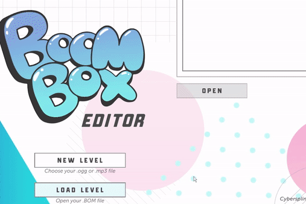
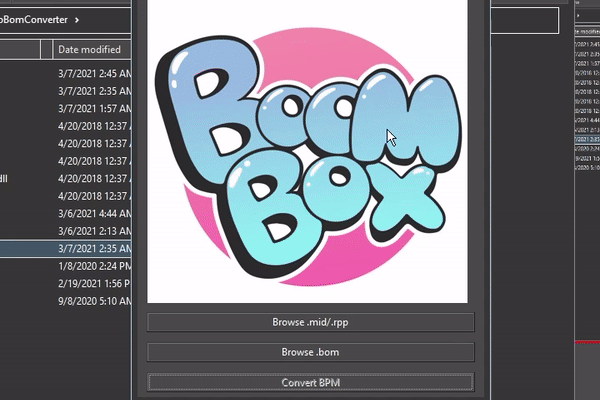

# Midi to Bom BPM Converter Scuffed Version 0.1 

This is a temporary tool to convert midi tempo changes to TimingPoints in the .box file. It also supports Reaper files (.rpp)

Written in Python because I'm cheap. 

The plan is to include these functionalities in the actual BoomBox Editor. Support for Reaper files in the tool is possible because of the easy to use existing Reaper parsers for Python. 

File converts BPM only but midi notes conversion could be possible in the future.

## DOWNLOAD .EXE

https://drive.google.com/file/d/1VmHSMC-BFp_srPHQ3nUdbdiHxyQxxHQp/view?usp=sharing

## CREDITS 

These are the Python libraries used:

MIDO
https://github.com/mido/mido

    Copyright (c) Ole Martin Bjørndalen

RPP
https://github.com/Perlence/rpp

    Copyright 2015 Sviatoslav Abakumov

https://docs.python.org/3/library/xml.etree.elementtree.html#xml.etree.ElementTree.Element

## OTHER

The Python Imaging Library (PIL) is

    Copyright © 1997-2011 by Secret Labs AB
    Copyright © 1995-2011 by Fredrik Lundh

Pillow is the friendly PIL fork. It is

    Copyright © 2010-2021 by Alex Clark and contributors
---

## HOW TO USE

Before converting any midi, make sure to sync the midi or rpp to the .ogg file you are using! 

1. Create a BOM file with the BoomBox Editor (make sure to make a back up if you are using an existing map)

2. Run MIDI to BOM Converter, load midi/rpp and bom files. Convert!

3. Open BOM file back in the editor

NOTE: IF YOU ARE MISSING A BPM CHANGE AT THE END, ADD AN EXTRA ONE TO YOUR MIDI/REAPER SESSION. The editor currently ignores the last "TimingPoint".

Beto
